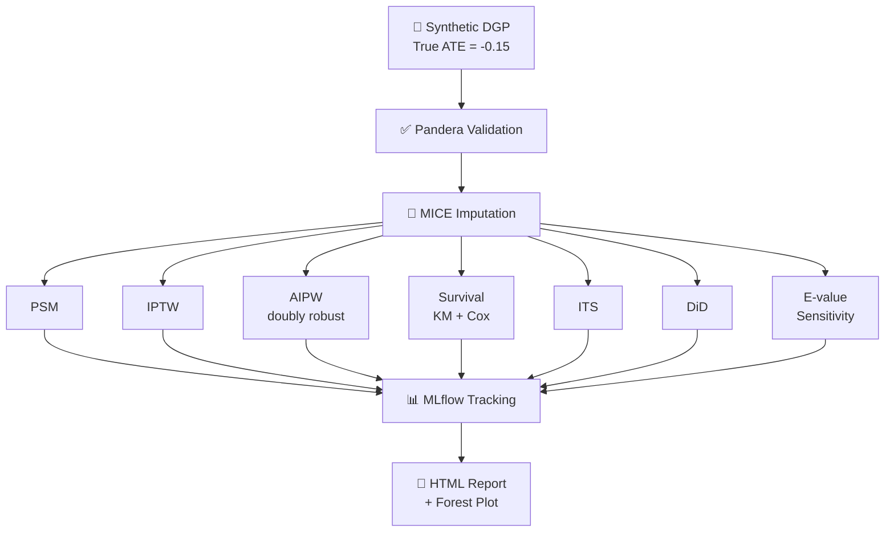

# rwe-causal-ops

[](https://github.com/lorellebrownlee/rwe-causal-ops/actions/workflows/ci.yml)
[](https://www.python.org/downloads/)
[](https://dvc.org/)
[](https://mlflow.org/)
[](https://github.com/psf/black)

A production-grade **Real World Evidence (RWE) causal inference pipeline** implementing 7 causal methods on synthetic observational data. Built with MLOps best practices: reproducible pipelines (DVC), experiment tracking (MLflow), automated quality gates (pre-commit), and CI/CD (GitHub Actions).

---

## Overview

Observational studies are central to RWE in health and pharma — but naive comparisons produce biased treatment effect estimates. This project demonstrates how to implement and triangulate multiple causal inference methods to recover the true Average Treatment Effect (ATE) from confounded data.

**True ATE (from DGP): -0.15**

| Method | ATE Estimate | SE | Bias from Truth |
|---|---|---|---|
| Propensity Score Matching (PSM) | -0.1200 | 0.0106 | 0.0300 |
| Inverse Probability of Treatment Weighting (IPTW) | — | — | — |
| Augmented IPTW / Doubly Robust (AIPW) | — | — | — |
| Difference-in-Differences (DiD) | — | — | — |
| Interrupted Time Series (ITS) | — | — | — |
| Kaplan-Meier / Cox Proportional Hazards | — | — | — |
| E-value Sensitivity Analysis | — | — | — |

> Run `dvc repro` to populate the full results table.

---

## Pipeline Architecture



---

## Methods

| Method | Assumption | Key strength |
|---|---|---|
| **PSM** | Ignorability given propensity score | Intuitive, matched pairs |
| **IPTW** | Positivity + ignorability | Uses full sample, no matching discard |
| **AIPW** | Either outcome or PS model correct | Doubly robust — preferred estimator |
| **Survival (KM/Cox)** | Non-informative censoring | Handles time-to-event outcomes |
| **ITS** | Parallel counterfactual trend | Exploits temporal discontinuity |
| **DiD** | Parallel trends | Controls for time-invariant confounding |
| **E-value** | None (sensitivity) | Quantifies unmeasured confounding threat |

---

## Project Structure

```
rwe-causal-ops/
├── src/
│   ├── data/
│   │   ├── dgp.py              # Synthetic data generating process
│   │   └── preprocess.py       # Pandera validation + MICE imputation
│   ├── methods/
│   │   ├── psm.py              # Propensity score matching
│   │   ├── iptw.py             # Inverse probability weighting
│   │   ├── aipw.py             # Doubly robust AIPW
│   │   ├── survival.py         # Kaplan-Meier + Cox PH
│   │   ├── its.py              # Interrupted time series
│   │   ├── did.py              # Difference-in-differences
│   │   └── sensitivity.py      # E-value analysis
│   └── reporting/
│       └── generate_report.py  # HTML report + forest plot
├── configs/                    # Per-method YAML configs
├── data/interim/               # Processed data (DVC-tracked)
├── results/                    # JSON metrics per method
├── reports/                    # Forest plot + HTML report
├── dvc.yaml                    # Pipeline DAG
├── params.yaml                 # Global parameters
├── .github/workflows/ci.yml    # GitHub Actions CI
├── .pre-commit-config.yaml     # black, flake8, isort
└── requirements.txt
```

---

## Quickstart

```bash
# Clone and set up environment
git clone https://github.com/lorellebrownlee/rwe-causal-ops.git
cd rwe-causal-ops
python -m venv .venv && source .venv/bin/activate
pip install -r requirements.txt

# Run the full pipeline
dvc repro

# Or run individual methods
python src/methods/psm.py
python src/methods/aipw.py

# View experiment results
mlflow ui
# → open http://127.0.0.1:5000
```

---

## Experiment Tracking

All runs are logged to MLflow with:
- **Metrics**: ATE, SE, bias from truth, method-specific diagnostics (e.g. max SMD for PSM, E-value for sensitivity)
- **Parameters**: method config from `configs/*.yaml`
- **Artefacts**: per-run result JSON

Navigate to **Evaluation Runs** in the MLflow UI to compare all 7 methods side by side.

---

## Data Generating Process

Synthetic data is generated with known ground truth to allow bias evaluation:

- **n = 10,000** observations
- **5 confounders** (age, comorbidity index, prior treatment, biomarker, site)
- **Treatment assignment** via logistic model (non-random, confounded)
- **Outcome** = continuous, linear in treatment + confounders + noise
- **True ATE = -0.15** (treatment reduces outcome by 0.15 units)
- **Missing data** introduced at random (MCAR/MAR), imputed via MICE

---

## Quality & Reproducibility

| Tool | Purpose |
|---|---|
| **DVC** | Reproducible pipeline DAG, data versioning |
| **MLflow** | Experiment tracking, metric logging |
| **Pandera** | Schema validation on input data |
| **black** | Code formatting |
| **flake8** | Linting |
| **isort** | Import sorting |
| **pre-commit** | Automated quality gates on every commit |
| **GitHub Actions** | CI — runs full pipeline on every push |

---

## Requirements

Python 3.11+. Key packages: `scikit-learn`, `lifelines`, `statsmodels`, `mlflow`, `dvc`, `pandera`, `pandas`, `numpy`.

```bash
pip install -r requirements.txt
```

---

## License

MIT
