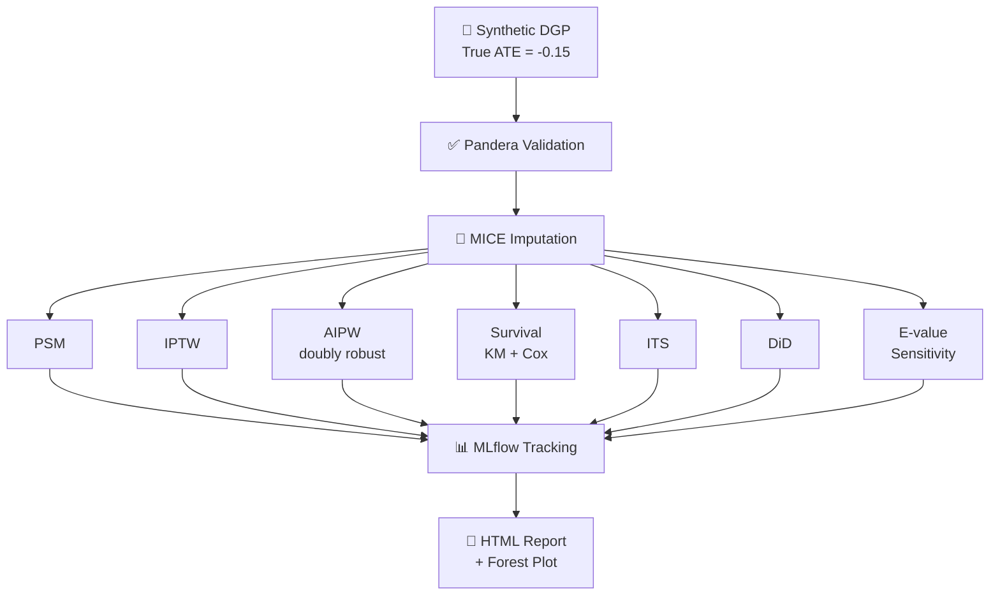

# rwe-causal-ops

[](https://github.com/lorellebrownlee/rwe-causal-ops/actions/workflows/ci.yml)
[](https://www.python.org/downloads/)
[](https://dvc.org/)
[](https://mlflow.org/)
[](https://github.com/psf/black)
[](https://www.docker.com/)

A production-grade **Real World Evidence (RWE) causal inference pipeline** implementing 7 causal methods on synthetic observational data. Built with MLOps best practices: reproducible pipelines (DVC), experiment tracking (MLflow), automated quality gates (pre-commit), and CI/CD (GitHub Actions).

---

## Overview

Observational studies are central to RWE in health and pharma — but naive comparisons produce biased treatment effect estimates. This project demonstrates how to implement and triangulate multiple causal inference methods to recover the true Average Treatment Effect (ATE) from confounded data.

**True ATE (from DGP): -0.15**

| Method | ATE Estimate | SE | Bias from Truth |
|---|---|---|---|
| Propensity Score Matching (PSM) | -0.1200 | 0.0106 | 0.0300 |
| Inverse Probability of Treatment Weighting (IPTW) | — | — | — |
| Augmented IPTW / Doubly Robust (AIPW) | — | — | — |
| Difference-in-Differences (DiD) | — | — | — |
| Interrupted Time Series (ITS) | — | — | — |
| Kaplan-Meier / Cox Proportional Hazards | — | — | — |
| E-value Sensitivity Analysis | — | — | — |

> Run `dvc repro` to populate the full results table.

---

## Pipeline Architecture



---

## Methods

| Method | What it does | When you'd use it | Key assumption |
|---|---|---|---|
| **PSM** (Propensity Score Matching) | Matches each treated patient to a similar untreated patient based on their probability of receiving treatment | When you want an intuitive "apples to apples" comparison | All confounders are measured |
| **IPTW** (Inverse Probability of Treatment Weighting) | Reweights patients so the treated and untreated groups look similar, without discarding anyone | When you want to use the full dataset rather than matched pairs | All confounders are measured, everyone has a realistic chance of either treatment |
| **AIPW** (Doubly Robust) | Combines a propensity score model and an outcome model — if either one is correct, the estimate is valid | When you want the most robust ATE estimate | At least one of the two models is correctly specified |
| **Survival Analysis** (KM + Cox) | Models time-to-event outcomes (e.g. time to death or hospitalisation) accounting for patients who haven't experienced the event yet | When the outcome is time-based, not just yes/no | Patients who leave the study early drop out randomly |
| **ITS** (Interrupted Time Series) | Looks at whether a trend in outcomes changed after a treatment or policy was introduced | When treatment was rolled out at a specific point in time | The pre-treatment trend would have continued unchanged |
| **DiD** (Difference-in-Differences) | Compares the change over time in a treated group vs. an untreated group | When you have data before and after treatment for both groups | Both groups would have followed parallel trends without treatment |
| **E-value Sensitivity Analysis** | Asks: "how strong would an unmeasured confounder need to be to explain away our result?" | After any causal analysis, to stress-test the findings | None — this is a robustness check, not a causal method |

---

## Project Structure

```
rwe-causal-ops/
├── src/
│   ├── data/
│   │   ├── dgp.py              # Synthetic data generating process
│   │   └── preprocess.py       # Pandera validation + MICE imputation
│   ├── methods/
│   │   ├── psm.py              # Propensity score matching
│   │   ├── iptw.py             # Inverse probability weighting
│   │   ├── aipw.py             # Doubly robust AIPW
│   │   ├── survival.py         # Kaplan-Meier + Cox PH
│   │   ├── its.py              # Interrupted time series
│   │   ├── did.py              # Difference-in-differences
│   │   └── sensitivity.py      # E-value analysis
│   └── reporting/
│       └── generate_report.py  # HTML report + forest plot
├── configs/                    # Per-method YAML configs
├── data/interim/               # Processed data (DVC-tracked)
├── results/                    # JSON metrics per method
├── reports/                    # Forest plot + HTML report
├── dvc.yaml                    # Pipeline DAG
├── params.yaml                 # Global parameters
├── .github/workflows/ci.yml    # GitHub Actions CI
├── .pre-commit-config.yaml     # black, flake8, isort
└── requirements.txt
```

---

## Quickstart

```bash
# Clone and set up environment
git clone https://github.com/lorellebrownlee/rwe-causal-ops.git
cd rwe-causal-ops
python -m venv .venv && source .venv/bin/activate
pip install -r requirements.txt

# Run the full pipeline
dvc repro

# Or run individual methods
python src/methods/psm.py
python src/methods/aipw.py

# View experiment results
mlflow ui
# → open http://127.0.0.1:5000
```

---

## Docker

Run the full pipeline and explore results in the MLflow UI without any local setup:

```bash
docker build -t rwe-causal-ops .
docker run -p 5000:5000 rwe-causal-ops bash -c "dvc repro --force && mlflow ui --host 0.0.0.0 --port 5000"
```

Then open `http://localhost:5000` to browse all 7 method runs side by side.

---

## Experiment Tracking

All runs are logged to MLflow with:
- **Metrics**: ATE, SE, bias from truth, method-specific diagnostics (e.g. max SMD for PSM, E-value for sensitivity)
- **Parameters**: method config from `configs/*.yaml`
- **Artefacts**: per-run result JSON

Navigate to **Evaluation Runs** in the MLflow UI to compare all 7 methods side by side.

---

## Data Generating Process

Synthetic data is generated with known ground truth to allow bias evaluation:

- **n = 10,000** observations
- **5 confounders** (age, comorbidity index, prior treatment, biomarker, site)
- **Treatment assignment** via logistic model (non-random, confounded)
- **Outcome** = continuous, linear in treatment + confounders + noise
- **True ATE = -0.15** (treatment reduces outcome by 0.15 units)
- **Missing data** introduced at random (MCAR/MAR), imputed via MICE

---

## Quality & Reproducibility

| Tool | Purpose |
|---|---|
| **DVC** | Reproducible pipeline DAG, data versioning |
| **MLflow** | Experiment tracking, metric logging |
| **Pandera** | Schema validation on input data |
| **black** | Code formatting |
| **flake8** | Linting |
| **isort** | Import sorting |
| **pre-commit** | Automated quality gates on every commit |
| **GitHub Actions** | CI — runs full pipeline on every push |

---

## Requirements

Python 3.11+. Key packages: `scikit-learn`, `lifelines`, `statsmodels`, `mlflow`, `dvc`, `pandera`, `pandas`, `numpy`.

```bash
pip install -r requirements.txt
```

---

## License

MIT
